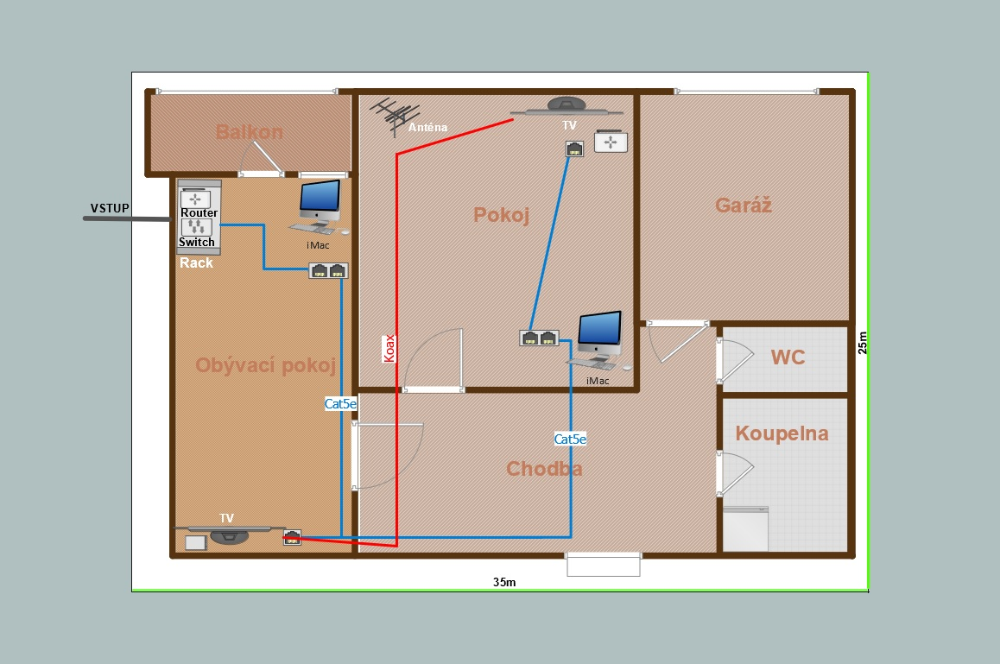
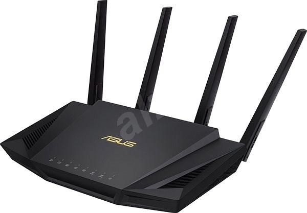
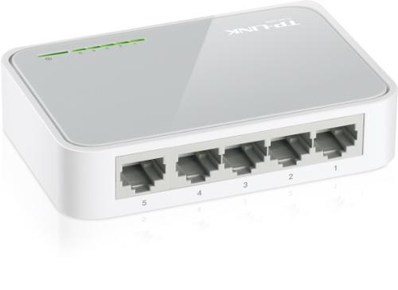
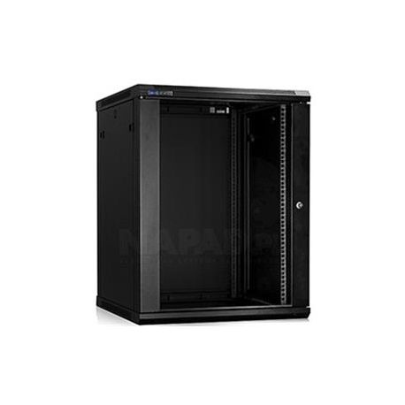
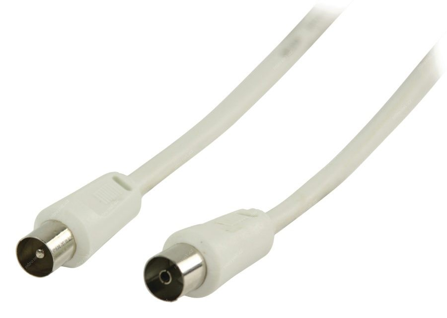
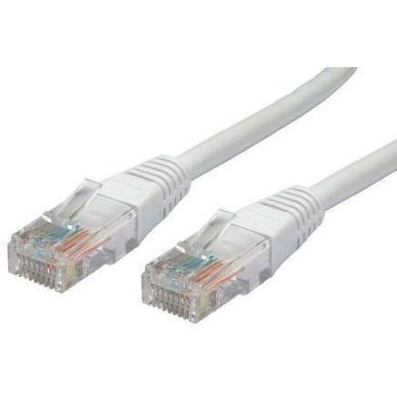

  # POS – Návrh domácí sítě
  Půdorys bytu, který je v přízemí i s garáží o celkové velikosti 25x35m²
  
  
   # RACK:
  Router: Asus cena 2500Kč
  
  
  
  Switch: Tplink za 450Kč
  
  
  
  Rack skříň: Neznačková za 3000Kč
  
  
  
  
  
  
  
  
  Kebely:
  25m KOAX kabelu za 450Kč
  
  
  
  60m síťového kabelu za 1500Kč
  
  
  
   
  
  
  
