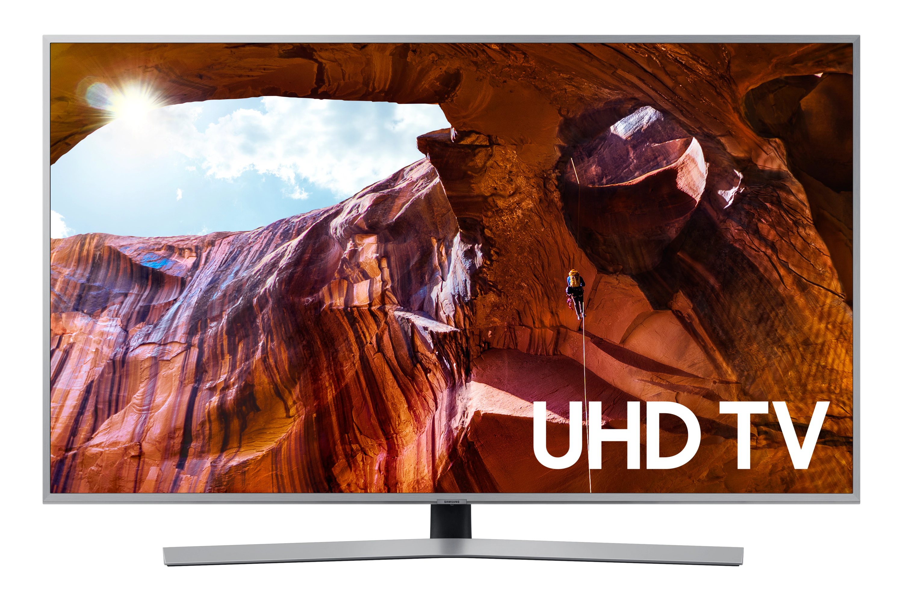
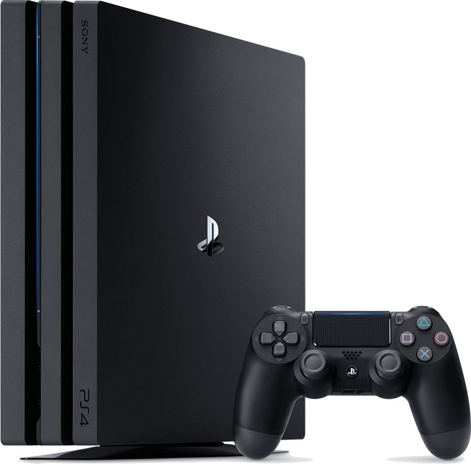

  # POS – Návrh domácí sítě
  Půdorys bytu obývaný 2 programátory, který je v přízemí i s garáží o celkové velikosti 25x35m²
  
  # Elektornika: 
  PC:  2x iMac 2019 s 5K za 65900,-/ks
  
  
  
  TV: 2x 55" 4K UHD SAMSUNG 35900,-/ks
  
  
  
  Herní konzole: 2x PS4 Pro za 10499,-/ks
  
  
  
  Audio: Studiová repro soustava Logitech za 20549,-
  
  
  
  Tiskárna: Multifunkční EPSON za 5500,-
  
  
  
  
  
  
  
   # RACK:
  Router: Asus cena 2500,-
  
  
  
  Switch: Tplink za 450,-
  
  
  
  Rack skříň: Neznačková za 3000,-
  
  
  
  
   # Kebely:
  25m KOAX kabelu za 450,-
  
  
  
  60m síťového kabelu za 1500,-
  
  
  
  # Anténa 
  EMOS TX-27LTE DVB-T2 za 950,-
  
  
   
  
  
  
