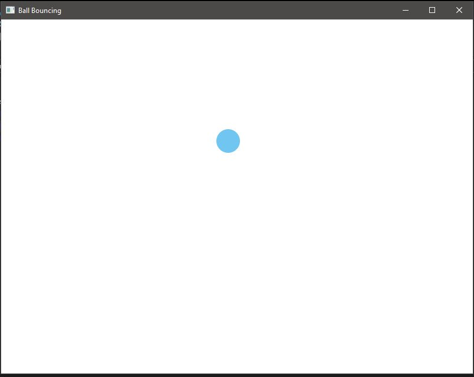
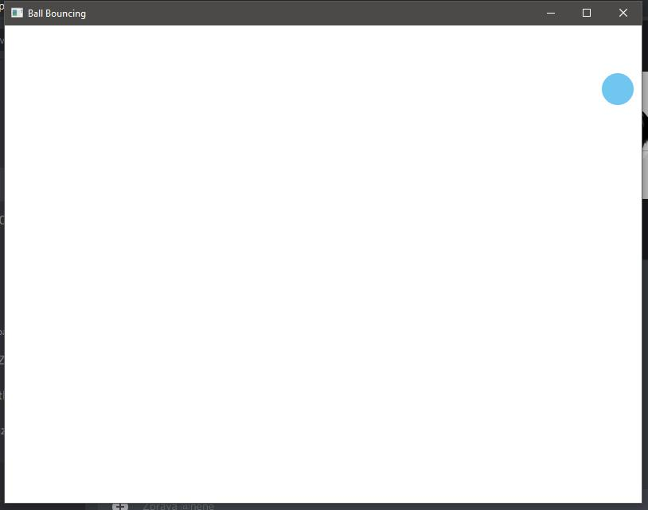
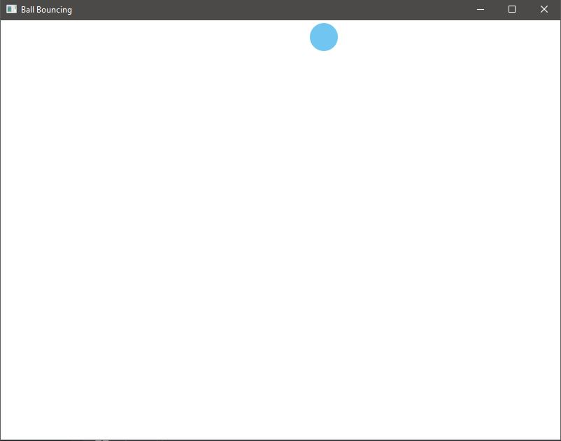

# Praxe - skupinová práce - Společná práce s Dominikou Kabátkovou, Waldemar Kotmel, Antonínem Vojtěchecm
# Náhodná Kulička vytvořená v JavěFX
 Start Programu, působení 
  
 Náhodný směr kuličky
 
 Odraz kuličky od stěny a náhodný směr a tekto furt do kola
 
 

Antonín Vojtěch - OOP, pohyb a odrážení 
Dominika Kabátková - Vykreslování
Waldemar Kotmel - Pomoc s vykreslováním a randomizace
Patrik Nagy - Randomizace 
