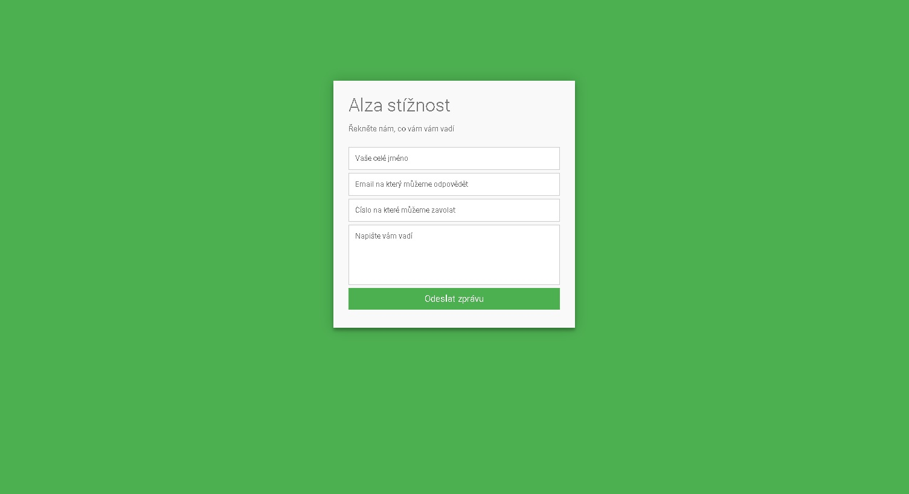
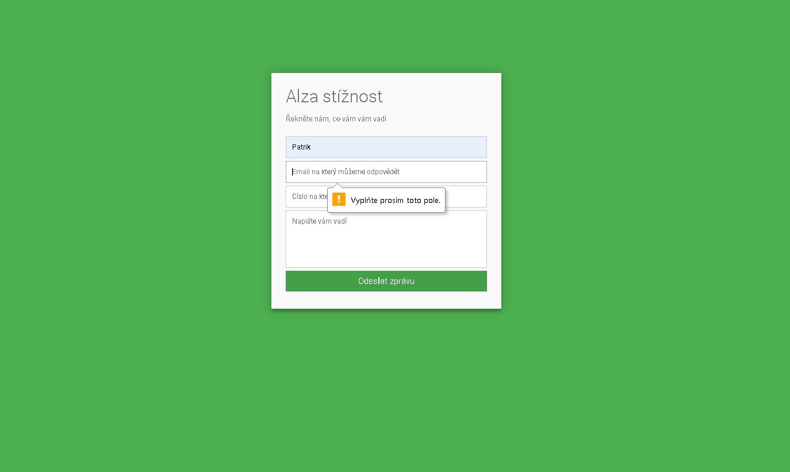
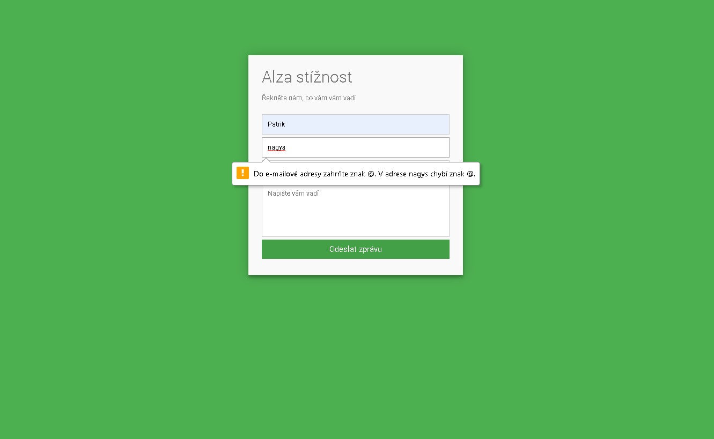
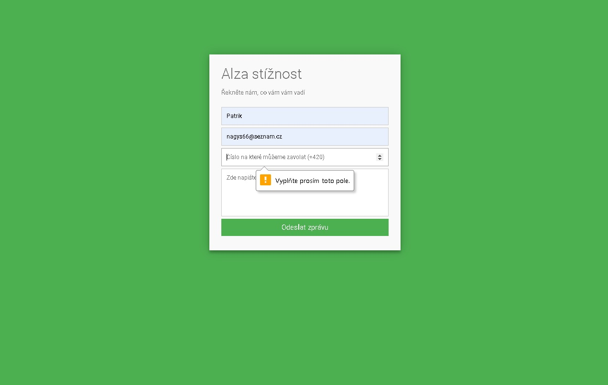
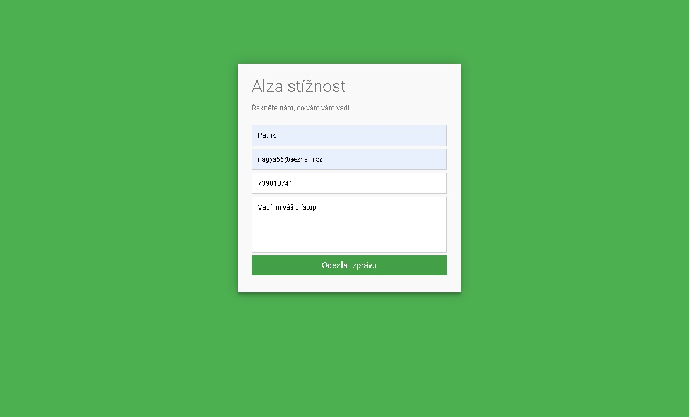
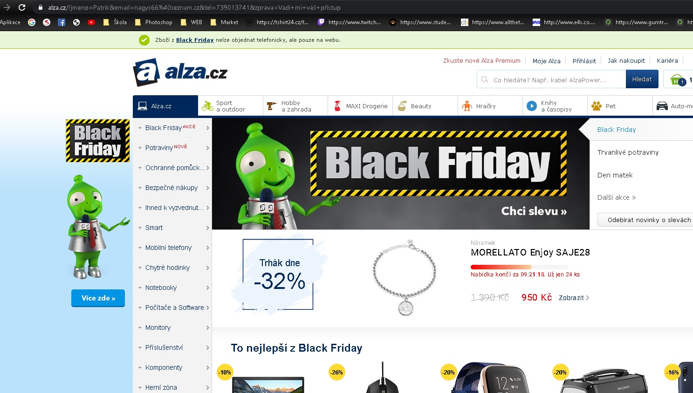

# WAP - Alza stížnostní -Formulář

Webowá stránka po otevření

Po zadání jména a kliknutí na Odeslat vyjede chybná hláška, vše musí být vyplněné 

Email je požadován ve spávném formátu

Tel. číslo musí obsahovat čísla

Spávné vyplnění formuláře, následné odelání

Po odeslání přesměrování na stránku Alza.cz a data lze vidět v URL adrese

URL Adresa - data

# S formulářem, na kterém by bylo využití JQueryUI jsem si nevědel rady, proto jsem použil HTML + CSS.

